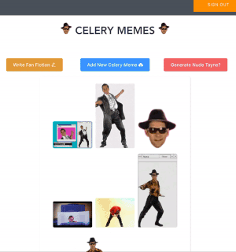
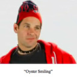

#  Celery Memes 

The best place to upload Celery Man, Tayne, Oyster, and Mozzarel media on the web!

> _It's actually just a fun exploration of AWS-Amplify, Vue, and Element UI_


**Let's Kick up the 4d3d3d3!**

### Features

1. Log in securely via AWS
2. Post Celery Man gifs via the image uploader. Images stored securely on AWS server.
3. **NEW** Write and post your very own Celery Man Fan Fiction! :tada: :books:

**Feature 2: Uploading Oyster**



### Coming Soon!

- Ability to generate a NUDE TAYNE :dizzy_face:

  > WARNING: This Feature will Not Be Suitable For Work

- Ability to report non-Celery Man related content.
- Ability to upvote/downvote content using custom symbols (Hat Wobble :thumbsup: OR Inverse Hat Wobble :thumbsdown: )
- Ability to generate a print out of Oyster Smiling

  

## Project setup

> If you set up the project locally you will need to create an `.amplifyrc` file and link to your AWS account. I will host the site when I am closer to finished!

```
yarn install
```

### Compiles and hot-reloads for development

```
yarn run serve
```

### Compiles and minifies for production

```
yarn run build
```

### Run your tests

```
yarn run test
```

### Lints and fixes files

```
yarn run lint
```

### Customize configuration

See [Configuration Reference](https://cli.vuejs.org/config/).
